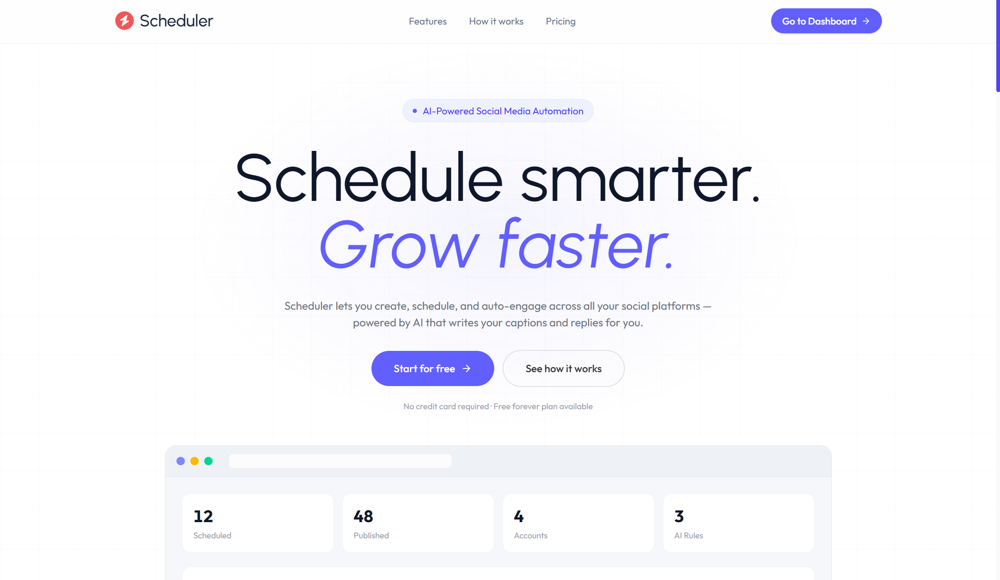
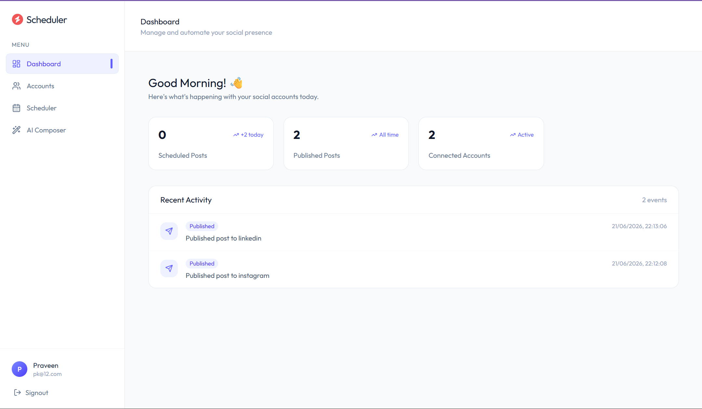
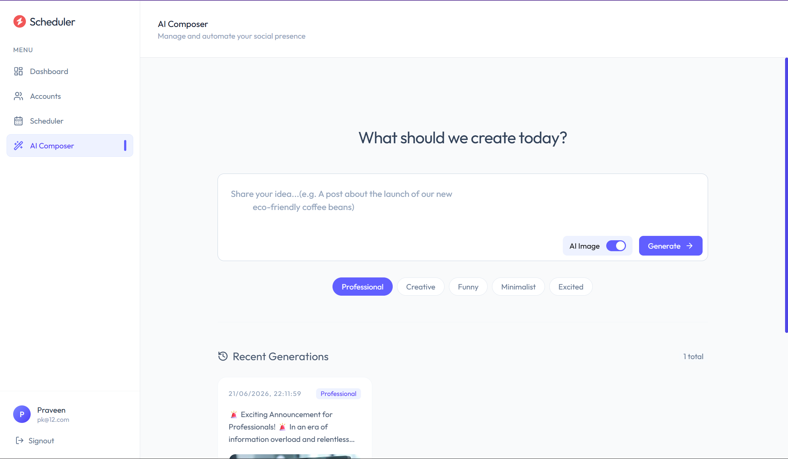
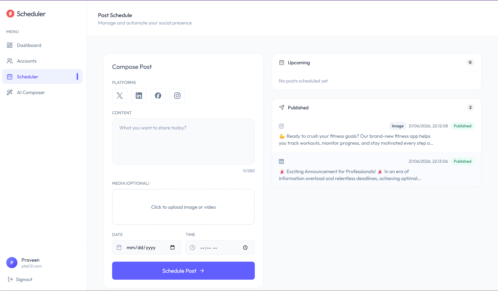
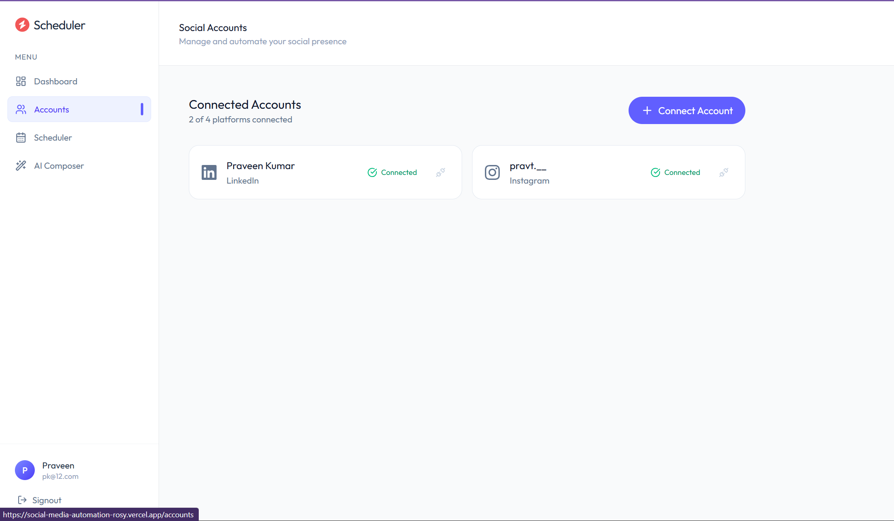
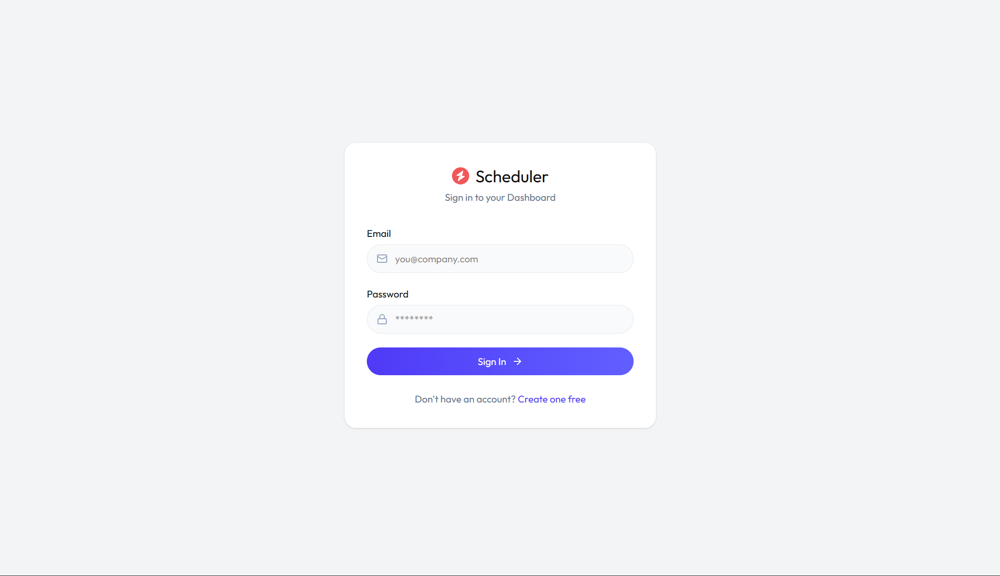

# 🚀 AI Social Media Automation Platform

An AI-powered full-stack MERN application that enables users to generate, schedule, and manage social media content with ease.

The platform uses **Google Gemini** for AI caption generation, **Pollinations.ai** for AI image creation, and provides an intuitive dashboard for scheduling and managing posts across connected social media accounts.

---

## 🌐 Live Demo

- **Frontend (Vercel):** https://social-media-automation.vercel.app
- **Backend API (Render):** https://social-media-automation-mlkl.onrender.com

---

## ✨ Features

- 🤖 AI-powered social media caption generation with Google Gemini
- 🎨 AI image generation using Pollinations.ai
- 📅 Schedule posts for future publishing
- 🔄 Automated scheduling workflow
- 📊 Dashboard with activity tracking and analytics
- 🔗 Manage connected social media accounts
- ☁️ Cloudinary integration for media storage
- 🔐 Secure JWT-based authentication
- 📱 Responsive UI built with React and Tailwind CSS

---

## 🛠️ Tech Stack

### Frontend

- React
- TypeScript
- Tailwind CSS
- React Router
- Axios
- Context API
- Lucide React

### Backend

- Node.js
- Express.js
- TypeScript
- MongoDB
- Mongoose
- JWT Authentication
- bcrypt
- Multer
- node-cron

### AI & Integrations

- Google Gemini API
- Pollinations.ai
- Cloudinary
- Zernio API

---

## 📸 Screenshots

### 🏠 Landing Page

### 📊 Dashboard

### 🤖 AI Composer

### 📅 Scheduler

### 🔗 Connected Accounts

### 🔐 Login

---

## 📂 Project Structure

SOCIAL_MEDIA_AUTOMATION/
│
├── client/
│   ├── src/
│   ├── components/
│   ├── pages/
│   ├── context/
│   └── api/
│
├── Server/
│   ├── controllers/
│   ├── models/
│   ├── routes/
│   ├── middleware/
│   ├── services/
│   └── config/
│
├── screenshots/
└── README.md

## 🔄 Workflow

User Prompt
      │
      ▼
Google Gemini
(Generate Caption)
      │
      ▼
Pollinations.ai
(Generate AI Image)
      │
      ▼
Cloudinary
(Store Image)
      │
      ▼
Create Scheduled Post
      │
      ▼
MongoDB
      │
      ▼
Scheduler Service
      │
      ▼
Publish to Connected Platforms

## ⚙️ Environment Variables

### Backend (`Server/.env`)

env
MONGODB_URI=
JWT_SECRET=

GEMINI_API_KEY=
ZERNIO_API_KEY=

CLOUDINARY_CLOUD_NAME=
CLOUDINARY_API_KEY=
CLOUDINARY_API_SECRET=

### Frontend (`client/.env`)

env
VITE_API_URL=

## 🚀 Installation

Clone the repository:

bash
git clone https://github.com/Praveen67hz/SOCIAL_MEDIA_AUTOMATION.git

Install backend dependencies:

bash
cd Server
npm install
npm run dev

Install frontend dependencies:

bash
cd ../client
npm install
npm run dev

## 🎯 Main Modules

- 🔐 Authentication
- 🤖 AI Composer
- 📅 Scheduler
- 📊 Dashboard
- 🔗 Connected Accounts
- 📝 Activity Tracking
- 🎨 AI Image Generation

## 🚀 Future Improvements

- Twitter/X integration
- Facebook support
- Content calendar
- Bulk scheduling
- AI hashtag recommendations
- Analytics dashboard
- Team collaboration
- Content templates

## 👨‍💻 Author

**Praveen Thakur**

 GitHub: https://github.com/Praveen67hz

## ⭐ Support

If you found this project helpful, consider giving it a ⭐ on GitHub!

## 📄 License

This project is licensed under the MIT License.
